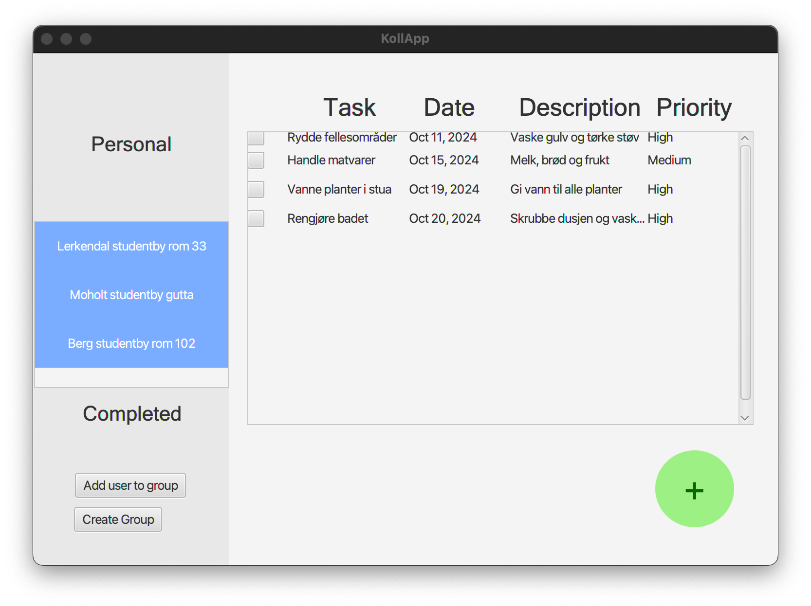

# KollApp 🏠💻

...is a Java-based application designed to assist roommates in a shared living environment to manage household tasks and communal activities more efficiently. The app aims to improve communication and coordination among flatmates by providing tools for organizing chores, tracking shared purchases, and planning social events.

---

## ✨ Features

**KollApp** simplifies shared living by managing tasks and events. It serves as a centralized platform that streamlines the management of shared living responsibilities. By combining task management, purchase tracking, and social planning features, the app enhances the overall living experience for roommates by promoting fairness, reducing misunderstandings, and fostering a sense of community.

With **KollApp**, you can:

- 📝 Assign tasks to roommates
- 💰 Track shared expenses
- 💬 Chat with your group to enhance communication
- 🔐 Register, log in, and secure access to your data
- 👥 Create and invite people to groups for task coordination

---

## 🎯 Purpose

- **Organize Shared Responsibilities**: Provide an overview of communal tasks such as cleaning, taking out the trash, and maintaining common areas.
- **Enhance Communication**: Improve the way roommates coordinate on chores and social activities to ensure tasks are evenly distributed and completed on time.
- **Prevent Duplicate Purchases**: Keep track of shared item purchases to avoid buying unnecessary duplicates of essentials like toilet paper or cleaning supplies.
- **Simplify Expense Tracking**: Log and view shared expenses to make sure everyone is contributing fairly to household costs, avoiding disagreements.
- **Enhance Group Communication**: Enable group chat to keep all roommates connected, making it easier to communicate about ongoing tasks and shared activities.

---

## ⚙️ Intended Functionality

### User Authentication 🔐

- **Secure Registration and Login**: Users can register with unique usernames and passwords and log in securely.
- **Error Handling**: Users receive feedback if there are registration or login issues (e.g., username already taken, password requirements not met).
- **Session Management**: Users can log out, ensuring their information is secure.

### Task Management 📝

- **Shared Task Overviews**: All roommates can view a list of communal tasks, including who is responsible for each and when they’re due.
- **Assigning and Tracking Tasks**: Tasks can be assigned to specific users with deadlines and priorities, with visibility on task completion status.
- **Personal Task Management**: Users can add personal tasks with details such as name, description, deadline, and priority, helping them keep track of individual responsibilities.

### Shared Purchases 💳

- **Expense Management**: Log shared expenses with details like amount and description, keeping all members informed of their balances.
- **View Purchase History**: Provide an accessible record of shared purchases to prevent duplicate buying and ensure transparency.

## Group Chat 💬

- **Facilitate Communication**: Users can send messages within their group to discuss ongoing tasks, make decisions, and stay in touch.
- **Message History**: The chat retains all messages, reminders, and decisions, making them accessible to all household members.
  
### Group Management 👥

- **Create Groups**: Users can create groups for specific sets of roommates, organizing tasks and activities within the group.
- **Invite Members**: Users can invite people to join their groups, making it convenient for new roommates or friends to participate.

---

## 📚 Suggested Reading

📖 See more detailed examples of **[User Stories](/docs/user_stories.md)**

---

📖 Return to the **[Main README](../readme.md)** for additional information and project overview.
