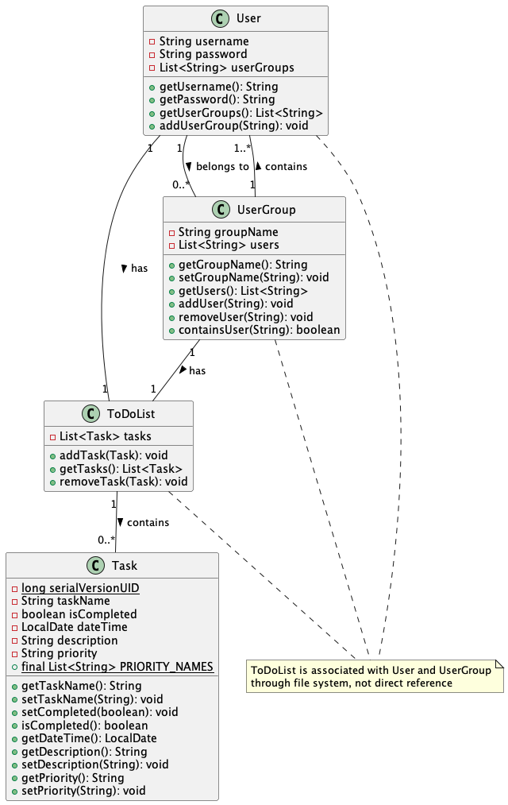
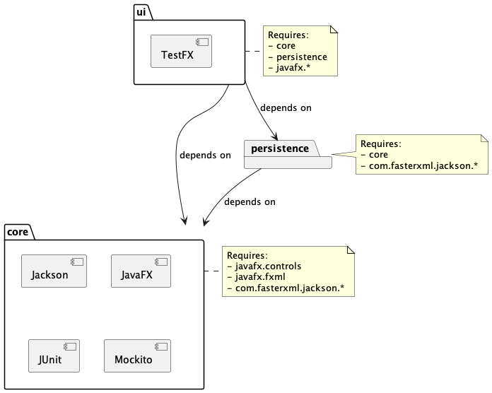

# 📊 Project Architecture Diagrams

## Class Diagram

We decided to create a class diagram for the core module of the **KollApp** project. This diagram provides a clear picture of the main classes and how they interact, giving a better understanding of the application's core structure. Here's a quick overview of the key components:

- **User**: Represents each person using the app, with details like their username, password, and the groups they belong to.
- **ToDoList**: Takes care of managing tasks, with methods to add and remove tasks.
- **Task**: Covers the details of each task, such as its name, due date, description, and priority level.
- **UserGroup**: Represents a group of users, including the group’s name and its list of members.

The diagram shows how these classes are connected and interact with each other, highlighting the relationships between users, to-do lists, tasks, and user groups within the core module.

---

## Package Diagram

Here is a view of our project’s package diagram, showing the structure of the different modules and their dependencies within the KollApp project.

---

📖 Return to the **[Main README](../../readme.md)** for additional information and project overview.