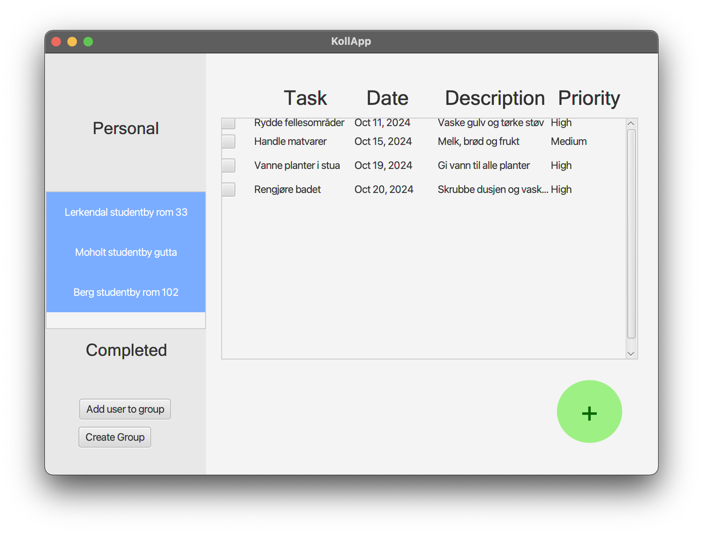
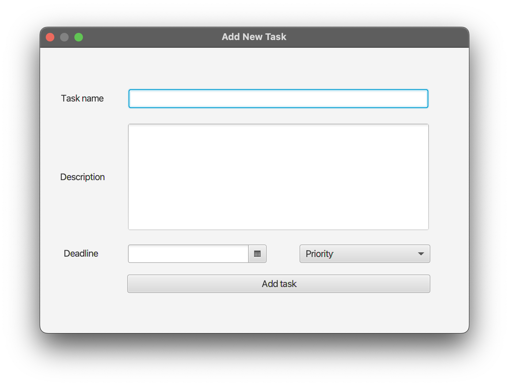
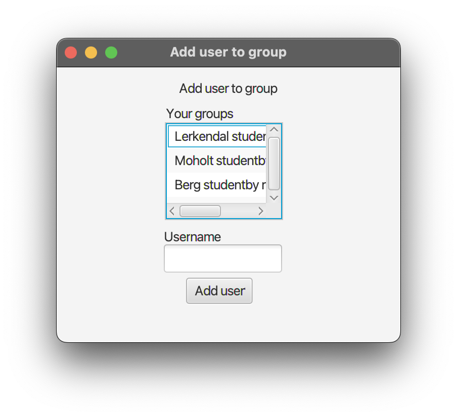
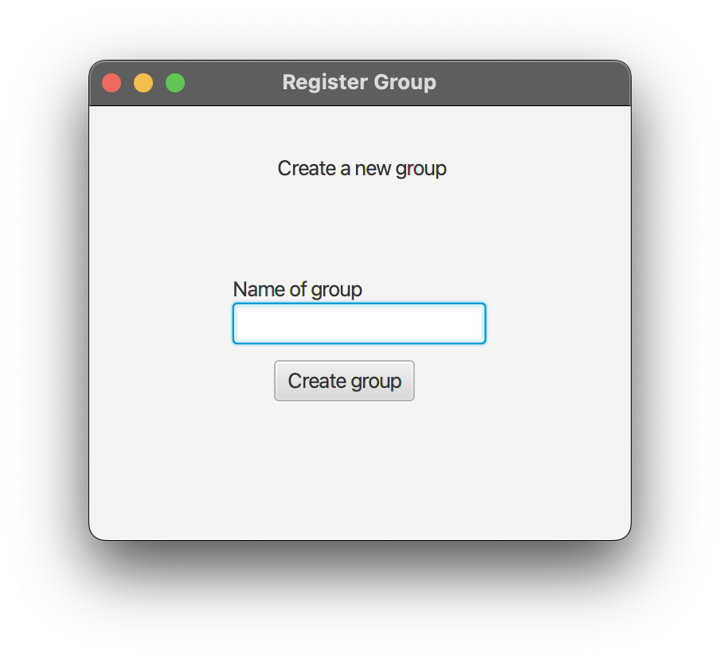

# 📸 Release 2 Gallery

Here are some screenshots showcasing the features and user interface of **KollApp** in Release 2. These images provide a visual overview of the application's design and functionality.

---

## Home Screen

The home screen provides an overview of the user's tasks, groups, and recent activities, making it easy to navigate and manage household responsibilities.

---

## Add Task

In this release, users can add tasks to their to-do lists, specifying details such as task name, due date, and priority level.

---

## Add User to Group

Users can now add other users to their groups.

---

## Create Group

Creating a new group is straightforward. You simply create unique name for your group.

---

📖 Return to the **[Main README](../../readme.md)** for additional information and project overview.
