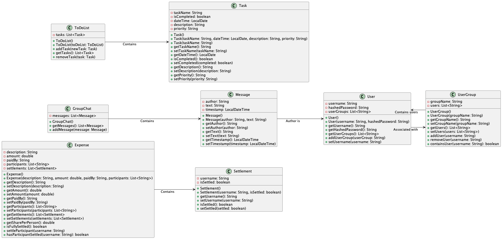
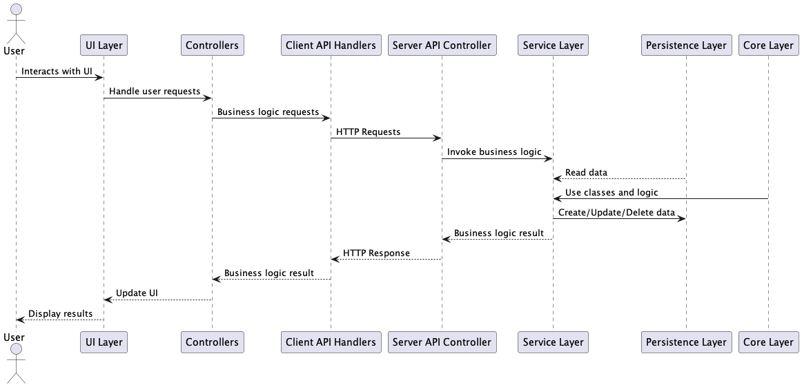
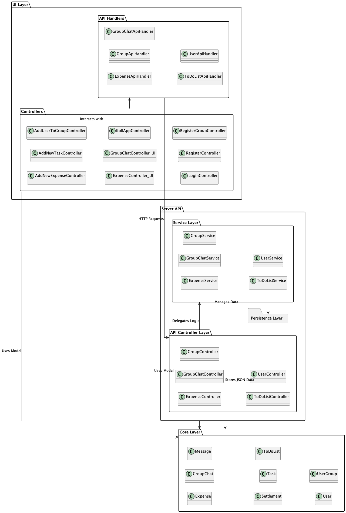

# 📊 Project Architecture Diagrams

---

## Class Diagram

The class diagram for the core module of **KollApp** provides a clear picture of the main classes and their interactions. It highlights the relationships between users, to-do lists, tasks, user groups, expenses, group chats, and messages.

- **User**: Represents each person using the app, with details like their username, hashed password, and the groups they belong to.
- **ToDoList**: Manages tasks, with methods to add and remove tasks.
- **Task**: Covers the details of each task, such as its name, due date, description, priority level, and completion status.
- **UserGroup**: Represents a group of users, including the group’s name and its list of members.
- **Expense**: Manages shared expenses, including details like description, amount, payer, participants, and settlements.
- **Settlement**: Represents the settlement status of a participant in a shared expense.
- **GroupChat**: Manages group messages, including a list of messages.
- **Message**: Represents a message in a group chat, including the author, text, and timestamp.

The diagram shows how these classes are connected and interact with each other.

---

## Sequence Diagram

The sequence diagram illustrates the flow of interactions between different layers of the **KollApp** application. This diagram helps in understanding the dynamic behavior of the system and the sequence of method calls involved in handling user requests.

---

## Package Diagram

Here is a view of our project’s package diagram, showing the structure of the different modules and their dependencies:

---

📖 Return to the **[Main README](../../readme.md)** for additional information and project overview.
