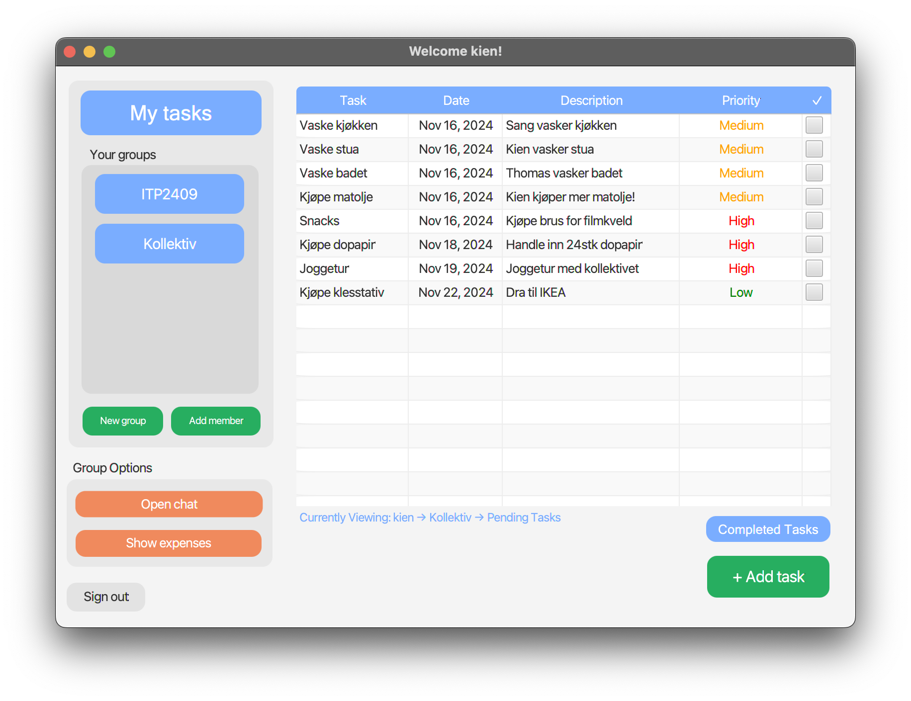

# 📸 Gallery for Release 3

Welcome to the **KollApp** gallery! Here, you can explore various screenshots that showcase the features and user interface of **KollApp**. These images provide a visual overview of the application's design and functionality.

---

## Login and Registration

### Login Screen

The login screen allows users to securely access their accounts by entering their username and password.

### Register Screen

New users can create an account by providing their username and password on the registration screen.

---

## Homescreen

### Dashboard

The dashboard provides an overview of the user's tasks, groups, and recent activities, offering quick access to various features.

---

## Task Management

### Add Task

Users can add new tasks by specifying the task name, description, deadline, and priority.

---

## Group Management

### Create Group

Users can create new groups by providing a group name.

### Add Users to Group

Users can add new members to their groups by specifying the username.

---

## Group Chat

### Group Chat

The group chat feature enables users to communicate with their group members, facilitating collaboration and coordination.

---

## Shared Expense Management

### Add New Expense

Users can add new expenses by specifying the expense name and amount.

### Shared Expense Overview

The shared expense management feature provides an overview of expenses, showing who paid and who owes money. Users can also settle expenses directly from this screen.

---

📖 Return to the **[Main README](../../readme.md)** for additional information and project overview.
