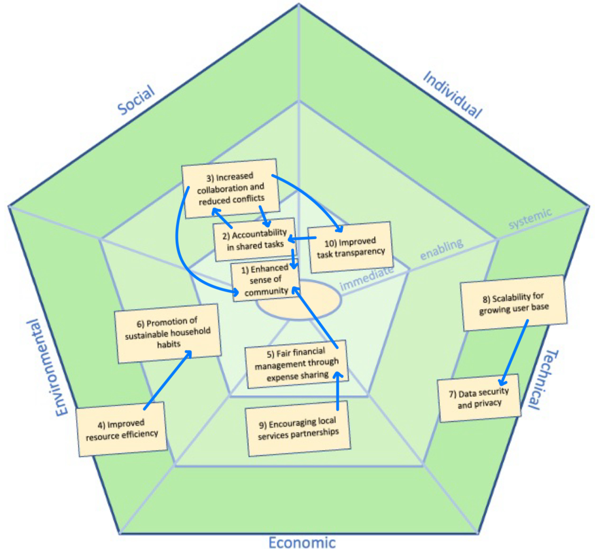

# 🌿 Sustainability Reflection on KollApp

The **KollApp** project, which helps support shared living spaces through effective task and expense management, has potential sustainability impacts across social, individual, economic, environmental, and technical dimensions. This reflection is based on the SusAF framework and aims to highlight both immediate and long-term effects, focusing on promoting collaboration, efficiency, and inclusivity in shared environments.

---

## 🌍 Social Dimension

**KollApp** contributes directly to social sustainability by making group collaboration more effective through features like **Group Management (US-3)**, **Shared Task Management (US-2)**, and **Group Chat (US-5)**. These functions help build a sense of community and improve participation and communication among group members, promoting accountability and reducing misunderstandings about shared tasks. However, there is still room for features that ensure everyone gets an equal say, like recognizing when someone is not contributing enough or adding tools that make decision-making more democratic within groups.

---

## 👤 Individual Dimension

**KollApp**'s **User Authentication (US-1)** and **Adding Personal Tasks (US-4)** give users control over their privacy and help them take charge of their personal responsibilities. This sense of ownership supports better organization and helps users manage their daily lives more effectively. However, a key challenge is maintaining a balance between usability and privacy, especially when shared tasks might inadvertently reveal personal schedules or workloads. Ensuring strong privacy measures is essential to help users feel secure and avoid any sense of intrusion.

---

## 🌱 Environmental Dimension

**KollApp**'s environmental impact is mostly indirect. The **Shared Task Management (US-2)** feature could help promote resource efficiency by optimizing household supplies, avoiding duplicate purchases, and minimizing waste. Adding features that encourage sustainable practices, like reminders for recycling or tracking resource usage, could boost **KollApp**'s environmental value even more. The app could also add a collaboration feature for shared eco-friendly tasks, like collective composting or waste management.

---

## 💰 Economic Dimension

The **Shared Expense Management (US-6)** feature provides financial benefits by making expenses more transparent and reducing potential disputes in shared spaces. This transparency also helps make the distribution of costs fairer, easing financial stress among users, especially students in shared living situations. The app could add even more value by partnering with local services to offer group discounts, adding an economic value incentive for collaborative purchases and shared activities.

---

## 🖥️ Technical Dimension

From a technical perspective, **KollApp**'s sustainability relies on maintainability and scalability as the number of users and features grows. The **User Authentication (US-1)** feature ensures data integrity and confidentiality, which is crucial for user trust. However, it is also important for the app to include strong data analytics to understand user behaviors and improve efficiency over time. Making sure the app can scale smoothly to handle increasing user demands, while staying efficient and user-friendly, is key to long-term technical sustainability.

---

## 📊 Summary for Sustainability Impacts

---

| ID | Impact Description                                | Sustainability Dimension | Level     | Influences | Influenced By |
|----|---------------------------------------------------|--------------------------|-----------|------------|---------------|
| 1  | Enhanced sense of community                       | Social                   | Immediate |            | 2, 3, 5       |
| 2  | Accountability in shared tasks                    | Social                   | Immediate | 1, 3       | 3, 10         |
| 3  | Increased collaboration and reduced conflicts     | Social                   | Enabling  | 1, 2, 10   | 2             |
| 4  | Improved resource efficiency                      | Environmental            | Systemic  | 6          |               |
| 5  | Fair financial management through expense sharing | Economic                 | Immediate | 1          | 9             |
| 6  | Promotion of sustainable household habits         | Environmental            | Enabling  |            | 4             |
| 7  | Data security and privacy                         | Technical                | Systemic  |            | 8             |
| 8  | Scalability for growing user base                 | Technical                | Systemic  | 7          |               |
| 9  | Encouraging local services partnerships           | Economic                 | Enabling  | 5          |               |
| 10 | Improved task transparency                        | Social                   | Immediate | 2          | 3             |

---

📖 Return to the **[Main README](../../readme.md)** for additional information and project overview.
